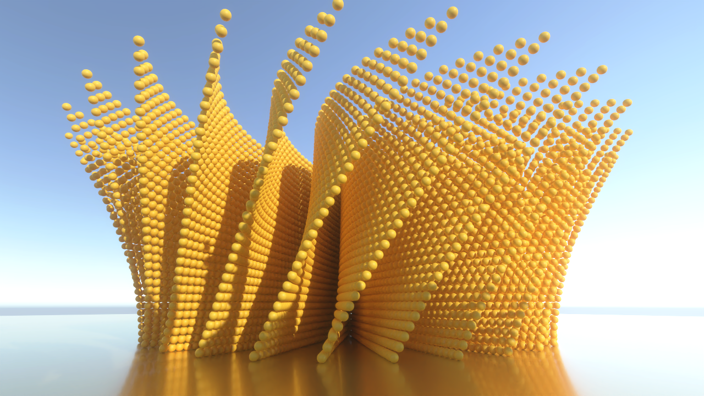

# RayTracingMeshInstancingHDRP
Unity sample project using Mesh instancing in HDRP Path Tracing.

## Description
The project uses [RayTracingAccelerationStructure.AddInstances](https://docs.unity3d.com/2023.1/Documentation/ScriptReference/Rendering.RayTracingAccelerationStructure.AddInstances.html) function to add many ray tracing Mesh instances to an acceleration structure. HDRP Path Tracing is used to generate a high-quality image.

The acceleration structure in this project is manually managed. This can be set in Ray Tracing Settings from Volume settings. [ManualRTASManager.cs](Assets/Scripts/ManualRTASManager.cs) is where the 3 procedural sculptures are generated and added to the acceleration structure. The rest of the scene can be added to the acceleration using [RayTracingAccelerationStructure.CullInstances](https://docs.unity3d.com/2023.1/Documentation/ScriptReference/Rendering.RayTracingAccelerationStructure.CullInstances.html) function.

Go to Game view and click on Play to generate the image. Intel Open Image Denoiser is used to remove the final noise.

## Prerequisites

* Windows 10 version 1809 and above.
* GPU supporting Ray Tracing ([SystemInfo.supportsRayTracing](https://docs.unity3d.com/2023.1/Documentation/ScriptReference/SystemInfo-supportsRayTracing.html) must be true).
* Unity 2023.1.0a17+.

## Resources
* [DirectX Raytracing (DXR) specs](https://microsoft.github.io/DirectX-Specs/d3d/Raytracing.html)
* [Unity Forum](https://forum.unity.com)
