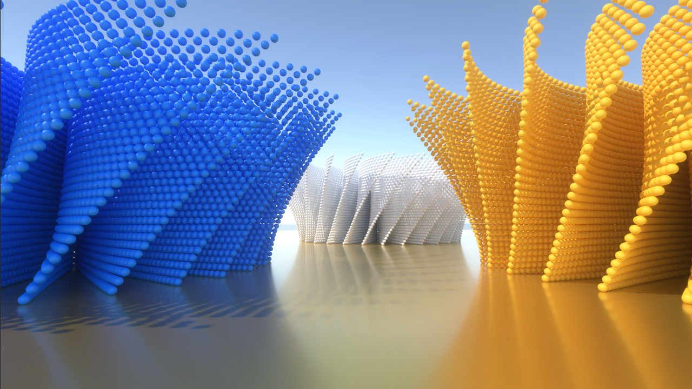

# RayTracingMeshInstancingHDRP
Unity sample project using an intersection shader (i.e. procedural geometry, AABBs) in HDRP Path Tracing.



## Description
The project uses [RayTracingAccelerationStructure.AddInstance](https://docs.unity3d.com/6000.0/Documentation/ScriptReference/Rendering.RayTracingAccelerationStructure.AddInstance.html) function to add a ray tracing instance using a list of AABBs instead of a regular mesh geometry. HDRP Path Tracing is used to generate a high-quality image.

```
public int AddInstance(Rendering.RayTracingAABBsInstanceConfig config, Matrix4x4 matrix, uint id);
```

Note that when using this function, Unity will automatically enable RAY_TRACING_PROCEDURAL_GEOMETRY shader keyword.

The acceleration structure in this project is manually managed. This can be set in Ray Tracing Settings from Volume settings. [ManualRTASManager.cs](Assets/Scripts/ManualRTASManager.cs) is where the procedural sculpture is generated out of AABBs and added to the acceleration structure. Regular scene geometries can be added to the acceleration structure using [RayTracingAccelerationStructure.CullInstances](https://docs.unity3d.com/2023.1/Documentation/ScriptReference/Rendering.RayTracingAccelerationStructure.CullInstances.html) function.

Go to Game view and click on Play to generate the image. Intel Open Image Denoiser is used to remove the final noise.

## Prerequisites

* Windows 10 version 1809 and above.
* GPU supporting Ray Tracing ([SystemInfo.supportsRayTracing](https://docs.unity3d.com/6000.0/Documentation/ScriptReference/SystemInfo-supportsRayTracing.html) must be true).
* Unity 2023.1

## Resources
* [DirectX Raytracing (DXR) specs](https://microsoft.github.io/DirectX-Specs/d3d/Raytracing.html)
* [Unity Forum](https://forum.unity.com)
